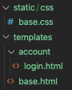
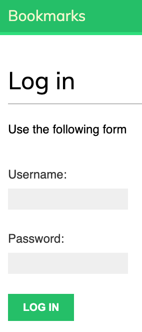
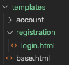

# Django Social Site

### Project will demonstrate

- Configuring the Django Authentication Network
- Setting up registration views for users
- Using a custom profile model to extend the users model
- Setting up authentication

#### Project setup

1) Create a dir callled `env` in terminal

     ~~~ bash
     mkdir env
     ~~~

2) Create virtual environment

     ~~~ bash
     python3 -m venv env/bookmarks
     ~~~

3) Activate virtual environment

     ~~~ bash
     source env/bookmarks/bin/activate
     ~~~

4) Install `Django` 

     ~~~ bash
     pip install django
     ~~~

5_ Create a new project

     ~~~ bash
     django-admin startproject bookmarks
     ~~~

6) Open new `bookmarks` directory and create `account` application

     ~~~ bash
     cd bookmarks
     django-admin startapp account
     ~~~

7) Update `settings.py` to include the `account` app

     ~~~ py
     INSTALLED_APPS = [
     'account',   # 'account.apps.AccountConfig' also works 
     'django.contrib.admin',
     'django.contrib.auth',
     'django.contrib.contenttypes',
     'django.contrib.sessions',
     'django.contrib.messages',
     'django.contrib.staticfiles',
     ]
     ~~~

8) Run migration

     ~~~ bash
     python manage.py migrate
     ~~~

#### Set up authentication views for login and logout

1) Background info

     - <a href = "https://docs.djangoproject.com/en/3.0/topics/forms/"> Django Forms Ref </a>
     - <a href = "https://docs.djangoproject.com/en/3.0/topics/auth/"> Django Authentication Ref </a>

     - Although authentication(verify user identity) and authentication(verify user permissions), the term `authentication` is used in the Django documenation to refer to both

     - Django's default authentication network manages
         - authentication
         - sessions
         - permissions
         - user groups

     - The authentication framework is part of the default settings of the `bookmarks` project
     - Inside of `settings.py` is comprised of the:
         - `django.contrib.auth` application in `INSTALLED_APPS`
         - `Authentication Middleware` middleware class in `MIDDLEWARE`
         - `SessionMiddleware` midddleware class in `MIDDLEWARE`
         - `User`, `Group`, `Permission` models

     - Although authentication(verify user identity) and authentication(verify user permissions), the term `authentication` is used in the Django documenation to refer to both

2) Set up login form by creating `forms.py` in the app's `account` folder

     - the `LoginForm` inherits from Djngo's `Form` class
     - <a href = "https://docs.djangoproject.com/en/3.0/topics/forms/"> Django Forms Ref </a>
     - the `PasswordInput` widget is used to render HTML element `password` using `type="password"`

     ~~~ py
     from django import forms

     class LoginForm(forms.Form):
          username = forms.CharField()
          password = forms.CharField(widget = forms.PasswordInput)
     ~~~

3) Create the `user_login` view in the app's `account` folder   

     - <a href = "https://docs.djangoproject.com/en/3.0/topics/http/views/"> Django Views Ref </a>

     - the `GET` request is used to instantiate a new login form template
     - the `POST` request will:
          -  `LoginForm(request.POST)` instantiates the form with user submitted data
          -  `is_valid()` verifies the entered data meets Django's criteria(e.g. password complexity, all fields are completed,...)
          - `cleaned_data` is an attribute saved into the form and allows for updating the database or perform additional processing prior to sending an `HTTP` redirect to the browser
          - `authenticate()` verifies the user data against the database using the `request `obj, `username`, and `password`. If verified, a `User` obj is returned. Failure returns a basic `HttpResponse` obj from the view. Otherwise, it returns `None`
          - `is_active` verifies if a registered user has a `disabled account`
          - the `login` method allows `active` users to join a `session` and returns a message to the user indicating success

     ~~~ py
     from django.shortcuts import render

     # Create your views here.
     from django.http import HttpResponse
     from django.contrib.auth import authenticate, login
     from .forms import LoginForm

     def user_login(request):
          # user has submitted a completed form
          if request.method == 'POST':
               form = LoginForm(request.POST) # instantiate with submiited data
               if form.is_valid():
                    cd = form.cleaned_data # saves validated data in form's cleaned_data attribute
                    user = authenticate(request, username = cd['username'], password = cd['password'])

                    # if valid
                    if user is not None:
                         if user.is_active:  # verify if disabled
                              login(request, user)
                              return HttpResponse('Authentication Successful')
                         else:
                              return HttpResponse('Account Disabled')

                    else:  
                         return HttpResponse('Invalid Login Credentials')        

          # e.g.  request.method == 'GET
          else:
               form = LoginForm() # initialize blank form template

          # present the initialized blank form to user
          context = {
               'form': form
               }
          return render(request, 'account/login.html', context)
     ~~~

4) Update `url patterns`     

     - create a new `urls.py` in the app's `account` folder and add the following:

          ~~~ py
          from django.urls import path 
          from . import views

          urlpatterns = [
               path('login/', views.user_login, name = 'login')
          ]
          ~~~

     - update the project's `bookmarks/bookmarks/urls.py` file    

          ~~~ py
          from django.contrib import admin
          from django.urls import path, include

          urlpatterns = [
          path('admin/', admin.site.urls),
          path('account/', include('account.urls'))
          ]
          ~~~

5) Create a login and base template     

     - 

     - add the following to `base.html`

          ~~~ html
          

          <!DOCTYPE html>

          <html>

               <head>
                    <title>  </title>
                    <link href = "" rel = "stylesheet" />
               </head>

               <body>
                    

                          Bookmarks 
                    

                    

                          
                         
                    

               </body>
          </html>
          ~~~

     - add the following to `login.html`

          ~~~ html
          

           Log in 

          

               <h1> Log in </h1>

               
 Use the following form 

               <form method = "post">
                    
                    {{ form.as_p }}
                    

                         <input type = "submit" value = "Log in">
                    

               </form>
          
          ~~~

6) Add the following to `base.css`

     ~~~ css
     @import url(http://fonts.googleapis.com/css?family=Muli);

     body {
     margin:0;
     padding:0;
     font-family:helvetica, sans-serif;
     }

     p {
     line-height: 1.8;
     }

     a {
     color:#12c064;
     text-decoration:none;
     }

     a:hover {
     color:#00a74f;
     }

     h1, h2, h3, h4, h5 , h6 { font-family: 'Muli', sans-serif; font-weight:normal; }

     h1 {
     border-bottom:1px solid #bbb;
     padding:0 0 10px 0;
     margin:10px 0 20px 0;
     }

     h2 {
     margin:30px 0 20px;
     }

     ol {
     line-height:1.5;
     }

     #header {
     padding:10px 100px;
     font-size:14px;
     background:#12c064;
     color:#fff;
     border-bottom:4px solid #1cdf78;
     overflow:auto;
     }

     #header .logo {
     font-family: 'Muli', sans-serif;
     float:left;
     color:#f3f7cc;
     font-size:20px;
     margin-right:10%;
     }

     #header ul.menu {
     list-style:none;
     float:left;
     margin:0;
     padding:0;
     }
     #header ul.menu li {
     float:left;
     padding:4px 10px;
     }

     #header ul.menu li.selected a, #header ul.menu li.selected a:hover {
     color:#1b6d32;
     font-weight:bold;
     }

     #header a {
     color:#f3f7cc;
     }
     #header a:hover {
     color:#fff;
     }

     #header .user {
     float:right;
     padding-top:4px;
     }

     #content {
     padding:30px 100px;
     }

     /* forms */
     form {
     overflow:auto;
     }

     form p {
     width:100%;
     overflow:auto;
     }

     label {
     float:left;
     clear:both;
     color:#333;
     margin-bottom:4px;
     }
     input, textarea {
     clear:both;
     float:left;
     margin:0 0 10px;
     background:#efefef;
     border:0;
     padding:6px 10px;
     font-size:14px;
     }
     input[type=submit], a.button {
     font-weight:bold;
     background:#12c064;
     color:#fff;
     padding:10px 20px;
     font-size:14px;
     text-transform:uppercase;
     }
     .errorlist {
     color:#cc0033;
     float:left;
     clear:both;
     padding-left:10px;
     }
     .helptext {
     margin:0 0 20px 0;
     color:#aaa;
     clear:both;
     float:left;
     font-size:13px;
     }
     /* messages */
     ul.messages {
     margin:10px 100px;
     padding:0;
     list-style-type:
     none;
     }
     ul.messages li.success,
     ul.messages li.warning,
     ul.messages li.error,
     ul.messages li.info {
     margin:0;
     padding:14px 20px;
     list-style:none;
     color:#fff;
     }

     ul.messages li.success { background:#81ce81; }
     ul.messages li.success a { color:#0ac33e; }

     ul.messages li.error { background:#a30029; color:#e9828e; }
     ul.messages li.error a { color:#e9828e; }

     ul.messages li.info { background:#faffae; color:#696b4e; }
     ul.messages li.info a { color:#1586de; }

     ul.messages li.warning { background:#de9404; }
     ul.messages li.warning a { color:#f49000; }

     ul.messages li a.close {
     margin:0;
     float:right;
     opacity:1;
     border:0;
     box-shadow:none;
     text-shadow:none;
     }

     .login-form {
     float:left;
     }

     /* social-auth */
     .social {
     float:right;
     }
     .social li {
     list-style:none;
     padding:10px 20px;
     margin:0 0 10px 0;
     }
     .social li a {
     width:100%;
     height:100%;
     display:block;
     color:#fff;
     }
     .social li.facebook { background:#3b5399; }
     .social li.twitter { background:#00cffa; }
     .social li.google { background:#de1710; }

     /* images */

     .image-preview, .image-detail {
     max-width:300px;
     float:left;
     margin:0 20px 20px 0;
     }
     .image-detail { margin-top:20px; }
     .image-info div {
     padding:20px 0;
     overflow:auto;
     }
     .count {
     color:#aaa;
     border:3px solid #bbb;
     border-radius:26px;
     padding:10px 20px;
     margin:20px 10px 0;
     }
     a.like, a.follow { float:right; margin-top:-8px; }

     #image-list { overflow:auto; }
     #image-list .image {
     float:left;
     width:220px;
     height:300px;
     margin:0 10px 10px 10px;
     border-top:8px solid #12c064;
     background:#eee;
     }
     #image-list img { width:220px; height:220px; }
     #image-list .info { padding:10px; }
     #image-list .info a { color:#333; }
     .image-likes div {
     float:left;
     width:auto;
     padding:10px;
     text-align:center;
     }
     .image-likes img {
     width:120px;
     height:120px;
     border-radius:50%;
     }

     /* users */
     #people-list img {
     width:180px;
     height:180px;
     border-radius:50%;
     margin-bottom:20px;
     }
     #people-list .user {
     width:180px;
     float:left;
     overflow:auto;
     padding:10px;
     }
     #people-list .info { text-align:center; }
     img.user-detail {
     border-radius:50%;
     float:left;
     }
     .profile-info {
     float:left;
     overflow:auto;
     margin-right:20px;
     }
     .image-container { margin-top:40px; }

     /* actions */
     .action {
     clear:both;
     overflow:auto;
     }
     .action .images {
     float:left;
     margin:0 10px 10px 0;
     }
     .action .date {
     font-style:italic;
     color:#ccc;
     }
     ~~~

7) Create a superuser

     ~~~ py
     python manage.py createsuperuser
     ~~~

8) Launch server, goto admin panel and create a new user

     ~~~ py
     python manage.py runserver
     ~~~

9) Attempt to login in newly created user credentials at the site `http://127.0.0.1:8000/account/login/`

     - the following should be displayed

          

#### Using Default Authentication Views

1) Background info

Django includes default class based views to handle operations associated with authentication

     - <a href = "https://docs.djangoproject.com/en/3.0/topics/auth/default/#all-authentication-views"> Django Authentication Views Ref </a>

     - Views associated with `django.contrib.auth.views`
          - LoginView
          - LogoutView
          - PasswordChangeView
          - PasswordChangeDoneView
          - PasswordResetView
          - PasswordResetDoneView
          - PasswordResetConfirmView
          - PasswordResetCompleteView

     - URL patterns used by `Django`
          - accounts/login/ [name='login']
          - accounts/logout/ [name='logout']
          - accounts/password_change/ [name='password_change']
          - accounts/password_change/done/ [name='password_change_done']
          - accounts/password_reset/ [name='password_reset']
          - accounts/password_reset/done/ [name='password_reset_done']
          - accounts/reset/<uidb64>/<token>/ [name='password_reset_confirm']
          - accounts/reset/done/ [name='password_reset_complete']

1) Update the app's `urls.py`

     - note the usage of specific `URLconf pattern` names
     - 

     ~~~ py
     from django.urls import path 
     from . import views

     urlpatterns = [
          # path('login/', views.user_login, name = 'login'),
          path('login/', auth_views.LoginView.as_view(), name = 'login'),
          path('logout/', auth_views.LogoutView.as_view(), name = 'logout'),  # required for using Django Authentication Views and default names

     ]
     ~~~

2) Create the following directory structure inside the templates folder

     

3) Create the `login.html` template inside the `registration` folder

     - `next` is initialized in the logiin view
     - the `next` parameter passed is a `URL` directed to by Django after successful login
     - `next` is initialized in the logiin view
     - this form used is from `django.contrib.auth.forms`

          ~~~ html
          

           Log-in 

          

               <h1> Log in </h1>

               
                    
 Username and/or password did not match 

               
                    
 Use the following form to log in 

               

               

                    <form action = "" method = "post">
                         {{ form.as_p }}
                         
                         <input type = "hidden" name = "next" value ="{{ next }}"/>
                         
 
                              <input type = "submit" value = "Log-in"/>
                         

                    </form>
               

               
           
          ~~~

4) Create the `logged_out.html` template 

     ~~~ py
     

      Logged Out 

     
          <h2> Logged out </h2>

          
 You are now loggged out 

          
 You can <a href = ""> log in again </a> 

     
     ~~~
5)  Update the `views.py` to direct logged in users to their `dashbaord`

     - a decorator is used to verify is user is authenticated
     - if authenticated, the `dashboard` view is run
     - if not authenticated, the 'GET' parameter called 'next' is used to redirect back to the login page qith  error messages
     - the login view redirects the user to the dashbaord utilizing the `hidden input` in the `login` template
     the `section` variable to track the part of the site(e.g. section) the user is on. Note that mutliple views may correspond to the same section

6) Create a `dashboard` template inside the `account` folder

     - the authentication middleware sets the user information in the HttpRequest obj
     - this information is available via the User obj using `request.user`

     ~~~ html
     

      Dashboard 

     
          <h1> Dashboard </h1>
          
 Welcome to your dashboard {{ request.user.first_name }} ! 

       
     ~~~

7) Update the app's `urls.py`

     ~~~ py
     urlpatterns = [
          # path('login/', views.user_login, name = 'login'),
          path('login/', auth_views.LoginView.as_view(), name = 'login'),
          path('logout/', auth_views.LogoutView.as_view(), name = 'logout'),
          path('', views.dashboard, name = 'dashboard')
     ~~~

8) Update the project's `settings.py` file

     - default URLs are defined
     - the `name` attribute corresponds to the URL patterns instead of hardcoding URLs

     ~~~ py
     LOGIN_REDIRECT_URL = 'dashboard'
     LOGIN_URL = 'login'
     LOGOUT_URL = 'logout'
     ~~~

9) Update `base.html` to provide customized information for the currently logged in user

     - the authentication middleware sets the user information in the HttpRequest obj
     - this information is available via the User obj using `request.user`
     - `is_authenticated` is used to verify if a user is authenticated
     - if not authenticated, the `Useer` obj sets the user to `AnonymousUser`

     ~~~ html
     

                     Bookmarks 
                         
                         <ul class = "menu">
                              <li  class = "selected" >
                                   <a href = ""> My dashboard </a>
                              </li>
                              <li  class = "selected" >
                                   <a href = "#"> Images </a>
                              </li>
                              <li  class = "selected"  >
                                   <a href = "#"> People </a>
                              </li>     
                         </ul>
                    

                    
                              
                              Hello {{request.user.first_name}},
                              <a href = ""> Logout </a>
                              
                              <a href = ""> Login </a>
                              
                    

               

     ~~~

#### Django Authentication Views for Changing Passwords

1) Create a `password_change_form.html` template inside the app's `account` folder

     ~~~ html
     

      Change password 

     
          <h1> Change your password </h1>
          
 Use the form below to change your password 

          <form method = "post">
               {{ form.as_p }}
               

                    <input type = "submit" value = "Change">
                    
               

          </form>

     
     ~~~

2) Create a `password_change_done.html` template inside the app's `account` folder

     - this is just to provide a simple confirmation message that the password change was successful

     ~~~ html
     

      Password changed 

     
          <h1> Password changed </h1>
          
 Your password was successfully changed 

     
     ~~~

3) Update the app's `urls.py` to add the template names to the paths     

     ~~~ py
     urlpatterns = [
          # path('login/', views.user_login, name = 'login'),
          path('login/', auth_views.LoginView.as_view(), name = 'login'),
          path('logout/', auth_views.LogoutView.as_view(), name = 'logout'),
          path('', views.dashboard, name = 'dashboard'),
          path('password_change/', auth_views.PasswordChangeView.as_view(), name = 'password_change'),
          path('password_change_done/', auth_views.PasswordChangeDoneView.as_view(), name = 'password_change_done'),
     ]
     ~~~

4) Test the templates by opening `http://127.0.0.1:8000/account/password_change/` in the browser and changing the passwords  